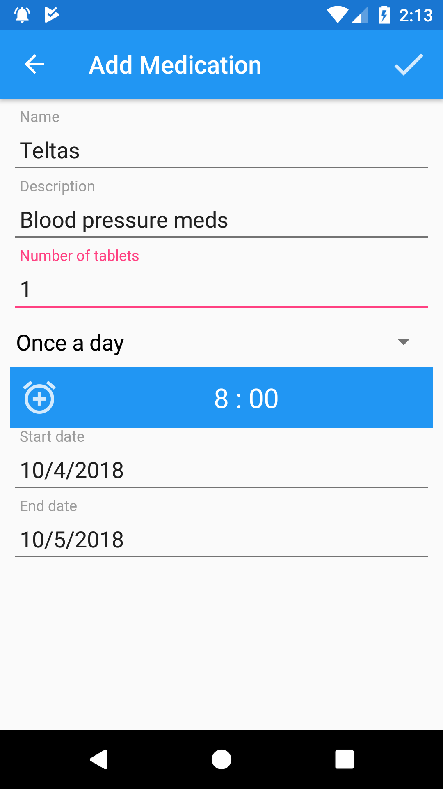
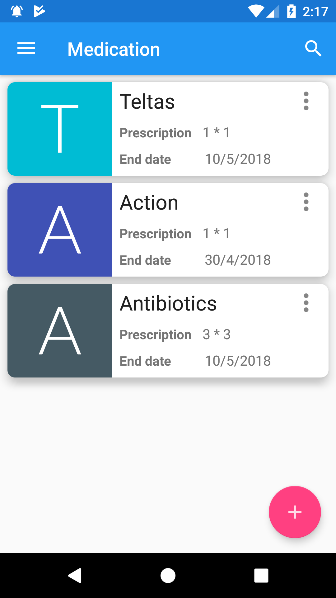

# Med-Manager-Android-App
  

The app helps users under medication to keep track of their prescription. It reduces/eliminates skipping of medication just because you forgot to take them.

## Prerequisites
- Java Installed
- Android Studion 3.0.1 or 3.1

After that is set up, then just clone the repo and launch the project folder using Android Studio

## Sign In Screen

Click on the sign in button to authenticate with you google account

## Add Medication
 | 
